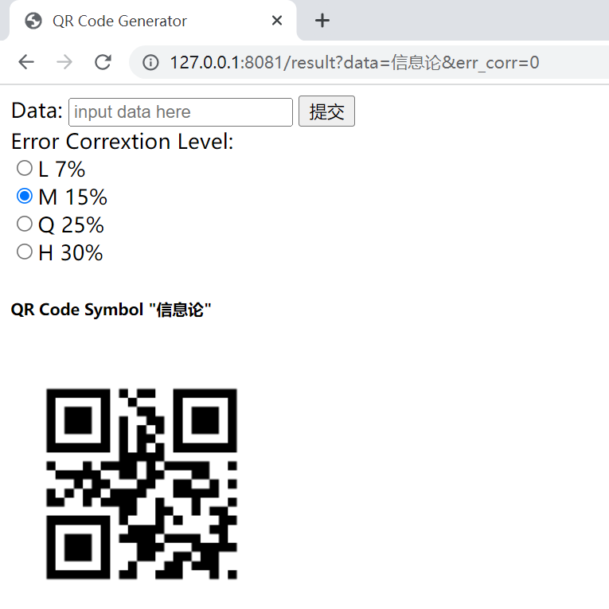

# SJTU-CS258-Project

This is a QR Code generator written in python!

## Module Required

```matplotlib```: Useful in generating image.

```flask```: Useful in rendering the web page. You don't have to install ```flask``` if you only want to use the module in python. 

## Features

- Generate optimal version and mask pattern for input data.
- Available for four modes of characters.
- Offer a web page QR Code generator for users

## Basic Usage of QRcode Module

Examples are as follows

```python
import QRcode
q = QRcode.QRcode()
q.add_data('QR Code')
q.make_image(name,save_dir)
```

And the QR Code symbol image in ```png``` format will be stored in the given save path. If ```name``` or  ```save_dir``` not given, the file will be stored in ```./MyQrCode``` and the name will be the input data. The generated QR Code is like below


Options of QRcode are as follow

```python
QRcode.QRcode(err_corr = constants.ERR_CORR_M,
                box_size = 10, 
              	border = 4,
                mask_pattern = None)
```

## Usage of QR Code Generator Web Page

Command in Terminal

```
python ./app.py
```

And the web page is like




## File Structure

```python
│  app.py
│  constants.py
│  QRcode.py
│  README.md
│  tree.txt
│  util.py
│  
├─templates
│      index.html
│      result.html
│      
└─__pycache__
        app.cpython-38.pyc
        constants.cpython-38.pyc
        QRcode.cpython-38.pyc
        util.cpython-38.pyc
        

```

